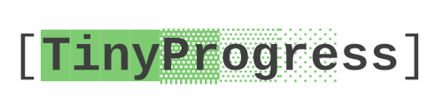

<p align="center">
  
</p>

**TinyProgress** is a minimal and lightweight progress bar module for Python. It provides an easy way to track progress in loops and iterables without requiring external dependencies.

<p align="center">
  
</p>

## 🚀 Features
- ✅ Simple and lightweight (no external dependencies)
- ✅ Customizable progress bar length and characters
- ✅ Supports named tasks
- ✅ Works with any iterable

## 📦 Installation
Since TinyProgress is a single-file module, you can simply copy `tinyprogress.py` into your project.

Alternatively, install it via pip (once published to PyPI):
```sh
pip install tinyprogress
```

## 🛠 Usage
### Basic Progress Bar
```python
from tinyprogress import progress
import time

for i in progress(range(100)):
    time.sleep(0.05)  # Simulating work
```

### Custom Progress Bar Length
```python
for i in progress(range(100), bar_length=50):
    time.sleep(0.05)
```

### Named Task Progress Bar
```python
for i in progress(range(100), task_name="Downloading"):
    time.sleep(0.05)
```

### Using Custom Characters
```python
for i in progress(range(100), fill_char='#', empty_char='-'):
    time.sleep(0.05)
```

## 🤝​ Contributing

First of all, thank you if you are interested in contributing to this project. To contribute, please carefully read the CONTRIBUTING file and follow its guidelines.

## 📜 License
GNU General Public License v3, see LICENSE file.